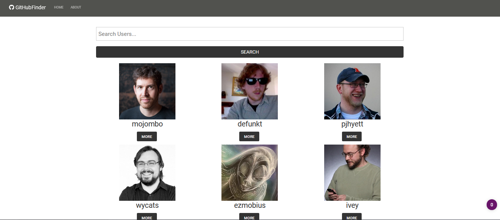
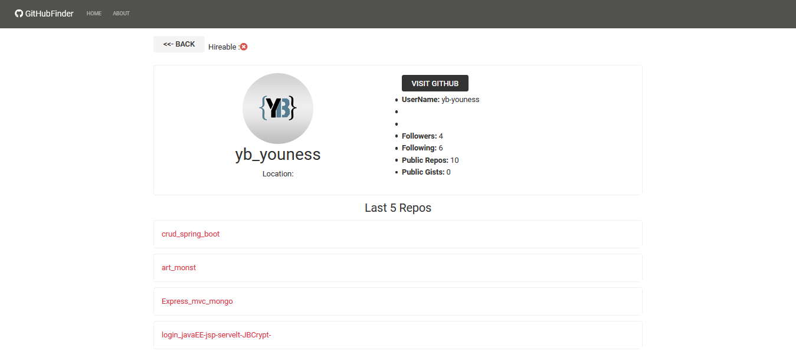

# GitHub Finder

---

### Deployed Site

https://byounessgithubfinder0.netlify.app/

## Description

- GitHub Finder Using Prop Drilling And Only Class Components

#### Fonctionnalites

- Get 30 User
- Search User By Name
- Get User Details
- Get User Last 5 Repos
- Validation For The Input
- Looding (spinner)
- About Page

---

#### Technologies

- JavaScript
- React (Using Prop Drilling And Only Class Components)

---

#### conf

-To Register Your Github App & Get Keys:
https://github.com/settings/applications/new

- You Need To Add in .env.local and add keyFor The Api  
  `REACT_APP_GITHUB_CLIENT_ID=yourkey` 
  `REACT_APP_GITHUB_CLIENT_SECRET=yoursecret`

---

#### Tools

- Vscode
